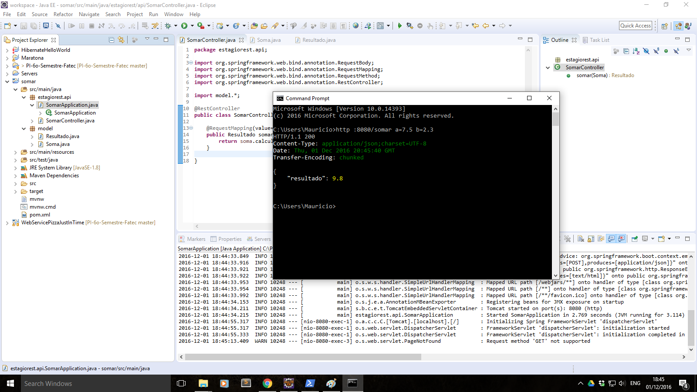

# EstagioREST

<b>Objetivo</b>
 
Crie uma API Rest em java que receba um POST com um json contendo dois valores "A" e "B" e retorne outro json com o "RESULTADO" da soma, coloque seu código no github ou no bitbucket explicando como devemos rodar a aplicação.

<b>Informações Gerais</b>
 
Para a codificação foram utilizados:
<ul>
	<li>Eclipse Neon</li>
	<li>Java 1.8</li>
	<li>Spring Boot</li>
</ul>
 
Para os testes de requisição json via POST, foi utilizada a ferramenta <a href="https://httpie.org/docs#json" target="_blank">httpie</a>. Abaixo o print:
